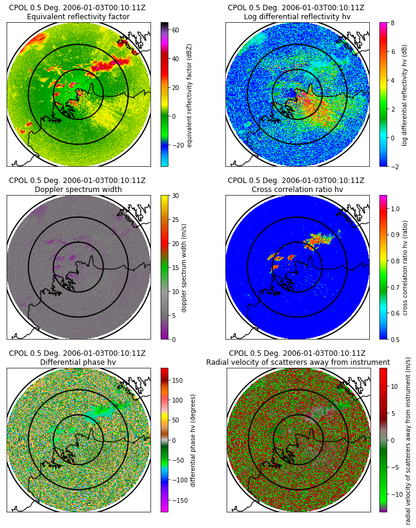
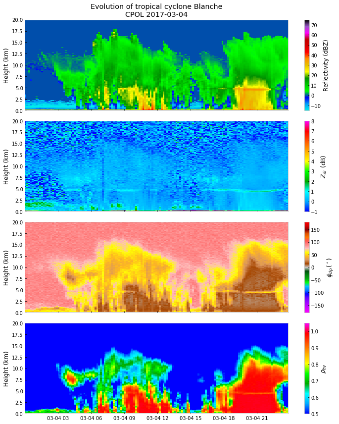
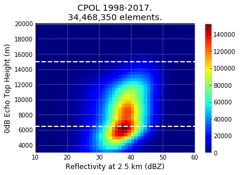

# Disclaimer

This dataset is supported by a funding from the U.S. Department of Energy as part of the Atmospheric Radiation Measurement (ARM) Climate Research Facility, an Office of Science user facility.

If you use this dataset to prepare a publication, please consider offering me (Valentin Louf) co-authorship and add the following line in the acknowledgments:

> This work has been supported by the U.S. Department of Energy Atmospheric Systems Research Program through the grant DE-SC0014063.

# CPOL general information

(Excerpt of my calibration paper)

> CPOL is a dual-polarization, Doppler radar, working at a frequency of 5.6 GHz with a pulse repetition frequency of 1000 Hz and a beamwidth of 1°. CPOL is located at Gunn Pt (-12.245°N, 131.045°E), about 25 km North-East from Darwin airport. CPOL performs a set of scans with an update time of 10 minutes. This includes, nominally, a volume scan, vertically pointing scan and two RHI scans. The scan comprises 15 elevations: 0.5°, 0.9°, 1.3°, 1.8°, 2.4°, 3.1°, 4.2°, 5.6°, 7.4°, 10°, 13.3°, 17.9°, 23.9°, 32°, and 43.1°. An additional series of scans at 90° is also performed regularly. The periodicity of the vertically pointing scan changes from season to season, and there are no such scans for seasons 2009/2010 and 2010/2011. The observed parameters are Z<sub>h</sub>, Z<sub>dr</sub>, Doppler velocity (v), differential phase φ<sub>dp</sub>, spectrum width σ<sub>v</sub>, and cross-correlation coefficient at zero lag ρ<sub>hv</sub>. The maximum unambiguous range of the volume scan is 140 km with a range gate spacing of 250 m and an azimuthal beam spacing of 1°. Between 2001 and 2007, to reduce the data size and allow real-time transmission to the regional forecasting office, the radar gate range was changed to 300 m, and data were sampled with an azimuthal resolution of 1.5°. Before 2007, the azimuthal indexing had to be corrected while, after 2007, the data are generated with the data synced to the azimuthal sampling. CPOL has produced more than 350,000 plan position indicator scans over 17 wet seasons (November to May) between 1998 to 2017. During that period, three seasons are missing: 2000/2001, 2007/2008, and 2008/2009. The first season is missing because the radar was moved to Sydney to support the 2000 Sydney Olympic games. The two latter seasons are missing because the radar antenna and receiver needed replacement.

The CPOL data are available at several levels. If you're not a radar guy, then you are probably interested in the level 2 data, as knowledge in radars and in signal processing are implicitly required to use the level 1 data. All levels use the netCDF format. The level 1 uses the CF/radial convention, while the level 2 tries to follow the CF convention.

## Level 1a

The level 1a are for the radar peoples who want to play with the raw data. At this level, nothing has been processed, nothing has been removed (artifacts, noise, and clutter are presents), and nothing has passed through any quality check. Only use it if you know what you're doing. $\rho_{hv}$ is missing from season 09/10, seasons after 2012 might contain a normalized coherent power field. The signal-to-noise ratio has to be computed for all seasons (radiosoundings are used for this).

On Raijin, the data are found here: `/g/data2/rr5/CPOL_radar/CPOL_level_1a`

## Level 1b

These are the processed data. It comes in 3 versions:
-	PPI (radar coordinates, i.e. polar). On Raijin, it is found here: `/g/data2/rr5/CPOL_radar/CPOL_level_1b/PPI`
-	GRIDDED (In Cartesian coordinates). For the gridded data, <b>the z-axis goes from 0 to 20 km of altitude by step of 0.5 km.</b>
    -	GRID_150km_2500m: Full domain, with a 2.5 km grid resolution: `/g/data2/rr5/CPOL_radar/CPOL_level_1b/GRIDDED/GRID_150km_2500m`
    -	GRID_70km_1000m: Half the domain, with a 1 km grid resolution: `/g/data2/rr5/CPOL_radar/CPOL_level_1b/GRIDDED/GRID_70km_1000m`

The PPIs contain the following fields:
-	D0, median diameter
-	NW, intercept parameter
-	corrected_differential_phase, corrected differential phase
-	corrected_differential_reflectivity, corrected differential reflectivity (attenuation and range correction)
-	corrected_specific_differential_phase, specific differential phase
-	cross_correlation_ratio, corrected cross correlation ratio (range correction).
-	differential_phase, raw differential phase
-	differential_reflectivity, raw differential reflectivity
-	radar_echo_classification, echo classification.
-	radar_estimated_rain_rate, rainfall rate (see appropriate citation down below)
-	raw_velocity, velocity of scatterers away from instrument
-	reflectivity, corrected reflectivity (noise and clutter remove, and attenuation corrected)
-	region_dealias_velocity, Doppler velocity dealiased using the region based algorithm
-	signal_to_noise_ratio, Signal to noise ratio, computed using radiosoundings from YPDN site.
-	specific_attenuation_differential_reflectivity, differential reflectivity specific attenuation, using Bringi's coefficients.
-	specific_attenuation_reflectivity, reflectivity specific attenuation, using Wu et al. relationship.
-	spectrum_width
-	temperature, from radiosoundings
-	total_power, uncorrected reflectivity

The gridded data are made using the Barnes at al. algorithm from Py-ART with a constant radius of influence of 2.5 km or 1 km (depending on the grid resolution). The 1 km resolution data have these dimensions (z, y, x) -> (41, 141, 141) and the 2.5 km resolution have these ones: (z, y, x) -> (41, 117, 117). The z dimension goes from 0 to 20 km by step of 500 m.
-	D0
-	NW
-	corrected_differential_reflectivity
-	cross_correlation_ratio
-	latitude
-	longitude
-	radar_echo_classification
-	radar_estimated_rain_rate
-	reflectivity
-	region_dealias_velocity
-	temperature
-	total_power
-	velocity

If you are interested in the gridding technique, please read Rob's post on github: [https://github.com/ARM-DOE/pyart/issues/753]

Quicklooks and animation for the lowest elevation of the PPI data are available in the folders `FIGURE_CHECK` and `ANIMATED_GIF`, respectively.

## Level 2

The level 2 are daily files, i.e. all the data for one day have been copied into a single file. Because the radar temporal resolution is 10 minutes, the time dimension length is 144 and it is set as constant in these files. These are 2D fields, but if 3D fields are a things of interest, then I'll consider adding them.

The data have constant dimensions:

- (time, y, x) -> (144, 117, 117) for the 2.5 km resolution files: `/g/data2/rr5/CPOL_radar/CPOL_level_2`
- (time, y, x) -> (144, 141, 141) for the 1 km resolution files: `/g/data2/rr5/CPOL_radar/CPOL_level_2_1km`

The following fields are available:
- Reflectivity at 2500 m, copied from the level 1b gridded, in: `/g/data2/rr5/CPOL_radar/CPOL_level_2/REFLECTIVITY`
- Rainfall rate, copied, and NaN values put to zero, from the level 1b gridded: `/g/data2/rr5/CPOL_radar/CPOL_level_2/RADAR_ESTIMATED_RAIN_RATE`
- Steiner echo classification (0: nothing, 1: stratiform, 2: convective) at 2500 m, computed using the reflectivity at 2500m:
`/g/data2/rr5/CPOL_radar/CPOL_level_2/STEINER_ECHO_CLASSIFICATION`
- The 0dB echo top height, computed using Lakshman algorithm on the level 1B PPIs and then gridded manually, in: `/g/data2/rr5/CPOL_radar/CPOL_level_2/ECHO_TOP_HEIGHT`


<b>If you want more level 2 fields (that are already present on level 1b), like velocity, D0, $Z_{dr}$, or else, just ask for it ;-) </b>

<b> IMPORTANT:</b> because we use a set of constant dimensions for all level 2 files, some time slices may be empty if no measurements have been made at this particular timestep. The variable called `isfile` will help you to know if measurements exist or not at a particular timestep. It is equal to 0 if there is no data and 1 if there is data.

# Georeferencing information

The gridded product in level 1b contains 2D array of latitude/longitude. Here are the georeferencing information that you can find in the level 2 files metadata:

```
:geospatial_bounds = "(129.70320368213441, 132.3856852067545, -13.552905831511362, -10.941777804922253)" ;
:geospatial_lat_min = "-13.552905831511362" ;
:geospatial_lat_max = "-10.941777804922253" ;
:geospatial_lat_units = "degrees_north" ;
:geospatial_lon_min = "129.70320368213441" ;
:geospatial_lon_max = "132.3856852067545" ;
:geospatial_lon_units = "degrees_east" ;
:geospatial_vertical_min = "0" ;
:geospatial_vertical_max = "20000" ;
:geospatial_vertical_resolution = "500" ;
:geospatial_vertical_units = "meters" ;
:origin_latitude = "-12.249" ;
:origin_longitude = "131.044" ;
:origin_altitude = "50" ;
:geospatial_projection = "Azimuthal equidistant projection" ;
```

In the next version of the CPOL level 2 data, these 2D lat/lon arrays will also be included.


## Important note about rainfalls

The level 1b is a 3D fields, because that's how the algorithm that compute the rainfall rate works, BUT the rainfall rate is a surface field, it does not have meaning after the first elevation/first slice. If you were to use the level 1b, then only use the first elevation/slice of the `radar_estimated_rain_rate`.

At level 1b: the hydrometeors retreivals, namely D0, NW, and the rainfall rate at this level don't have any sort of post-processing applied to them, they are direct output from the algorithm that has been used to compute these fields. Meaning that <b>if the radar did not measure anything, then the rainfall rate is equal to NaN, not zero, even inside the radar domain.</b>

At level 2: a post processing has been applied, the rainfalls has been put to zero instead of NaN. What is NaN is outside the CPOL domain. Inside the domain the rainfall rates have real values.

Moreover, [Bobby Jackson][https://github.com/rcjackson] (Argonne Laboratory) recently worked CPOL rainfall rate retrievals and made comparisons with impact and video disdrometers. Here are his conclusion:
> The best estimate we have for rainfall so far is from the Thompson et al. blended technique .Thankfully, this is the one that Valentin already has in his processing code, so literally no work needs to be done to put that in the latest version. The only thing we are working on now is collaborating with Elizabeth Thompson on using her disdrometer data to estimate the retrieval random uncertainty by looking at the P.D.F. of rainfall rate as a function of the various moments and calculating the quartiles of the P.D.F at the given moments.

## How to cite CPOL and/or the different products

CPOL instrument:

> Keenan, T. et al. The BMRC/NCAR C-Band Polarimetric (C-POL) Radar System. J. Atmos. Ocean. Technol. 15, 871–886 (1998).

CPOL calibration:

> Louf, V. et al. An integrated approach to weather radar calibration and monitoring using ground clutter and satellite comparisons. J. Atmos. Ocean. Technol. (Under review).

The level 1b were produced using the Py-ART software, it should be cited:

> Helmus, J. J. & Collis, S. M. The Python ARM Radar Toolkit (Py-ART ), a Library for Working with Weather Radar Data in the Python Programming Language. J. Open Res. Softw. 4, e25 (2016).

The following products are not "raw measurements" from the radar, they have been retrieved using various algorithm. If you use one of these products, the correct citations are:

Rainfall rate estimates:

> Thompson, E. J., Rutledge, S. A., Dolan, B., Thurai, M. & Chandrasekar, V. Dual-Polarization Radar Rainfall Estimation over Tropical Oceans. J. Appl. Meteorol. Climatol. 57, 755–775 (2018).

Steiner echo classification:

> Steiner, M., Houze, R. A. & Yuter, S. E. Climatological Characterization of Three-Dimensional Storm Structure from Operational Radar and Rain Gauge Data. J. Appl. Meteorol. 34, 1978–2007 (1995).

Echo top height:

> Lakshmanan, V., Hondl, K., Potvin, C. K. & Preignitz, D. An Improved Method for Estimating Radar Echo-Top Height. Weather Forecast. 28, 481–488 (2013).

Here a recent paper were we verify the Echo top height:

> Jackson, R. C., Collis, S. M., Louf, V., Protat, A. & Majewski, L. A 17 year climatology of convective cloud top heights in Darwin. Atmos. Chem. Phys. Discuss. 1–26 (2018). doi:10.5194/acp-2018-408

For other products, like the dual-polarisation radar products, just contact me (I haven't listed them as I suppose very few people might know about them).

# Known issues / future version

Level 2:
- Only 1D arrays of latitude/longitude (the lat/lon crossing the radar origin) are available in the level 2, this should be fix in the next version. For now, use the georeferencing information in the metadata to rebuild the lat/lon arrays, or read the lat/lon arrays from the gridded level 1b files (next version).

Level 1b and potentially future level 2:
- There are problems with the velocity dealiasing, due to a lack of <i> competent </i> dealiasing algorithms. We developped a new and promising method of dealiasing that hopefully will solve this issue (next version).

Level 1b:
- Processing of dual-polar products are always a struggle that is incrementally improved, the next version should use a more performing PHIDP/KDP processing.
- The level 1b rainfall rates don't contain true zero values, but NaN values instead, it's not a bug, it's a feature (direct processing output). Use the level 2 rainfalls, or filled the array with zero and put to NaN all values outside of the radar domain.

# Example with the level 1a

Let's read, display information and plot some raw data.


```python
%matplotlib inline
import glob
import warnings
import netCDF4
import pyart
import numpy as np
import matplotlib.pyplot as pl
import dask
import dask.bag as db
from dask.diagnostics import ProgressBar
warnings.simplefilter('ignore')
```

```python
radar = pyart.io.read('/g/data2/rr5/CPOL_radar/CPOL_level_1a/2006/20060103/cfrad.20060103_001000.000_to_20060103_001816.000_CPOL_PPI_level1a.nc')
```


```python
radar.info('compact')
```

    altitude: <ndarray of type: float64 and shape: (1,)>
    altitude_agl: None
    antenna_transition: None
    azimuth: <ndarray of type: float32 and shape: (4148,)>
    elevation: <ndarray of type: float32 and shape: (4148,)>
    fields:
    	DBZ: <ndarray of type: float64 and shape: (4148, 480)>
    	VEL: <ndarray of type: float64 and shape: (4148, 480)>
    	WIDTH: <ndarray of type: float64 and shape: (4148, 480)>
    	ZDR: <ndarray of type: float64 and shape: (4148, 480)>
    	PHIDP: <ndarray of type: float64 and shape: (4148, 480)>
    	RHOHV: <ndarray of type: float64 and shape: (4148, 480)>
    fixed_angle: <ndarray of type: float32 and shape: (17,)>
    instrument_parameters:
    	frequency: <ndarray of type: float32 and shape: (1,)>
    	pulse_width: <ndarray of type: float32 and shape: (4148,)>
    	prt: <ndarray of type: float32 and shape: (4148,)>
    	polarization_mode: <ndarray of type: |S1 and shape: (17, 32)>
    	radar_beam_width_h: <ndarray of type: float32 and shape: (1,)>
    	radar_beam_width_v: <ndarray of type: float32 and shape: (1,)>
    latitude: <ndarray of type: float64 and shape: (1,)>
    longitude: <ndarray of type: float64 and shape: (1,)>
    nsweeps: 17
    ngates: 480
    nrays: 4148
    radar_calibration: None
    range: <ndarray of type: float32 and shape: (480,)>
    scan_rate: <ndarray of type: float32 and shape: (4148,)>
    scan_type: ppi
    sweep_end_ray_index: <ndarray of type: int32 and shape: (17,)>
    sweep_mode: <ndarray of type: |S1 and shape: (17, 32)>
    sweep_number: <ndarray of type: int32 and shape: (17,)>
    sweep_start_ray_index: <ndarray of type: int32 and shape: (17,)>
    target_scan_rate: None
    time: <ndarray of type: float32 and shape: (4148,)>
    metadata:
    	Conventions: CF/Radial instrument_parameters
    	version: 2017-10
    	title: PPI volume from Australia Bureau of Meteorology
    	institution: Australia Bureau of Meteorology
    	references: If you use this dataset, please cite: 'An integrated approach to weather radar calibration and monitoring using ground clutter and satellite comparisons' by Louf et al. 2018 Journal of Atmospheric and Oceanic Technology.
    	source:
    	comment: This dataset has been created by Valentin Louf at the Bureau of Meteorology for Monash University and ARM.
    	instrument_name: CPOL
    	original_container: UF
    	site_name: Gunn_Pt
    	radar_name: CPOL
    	field_names: DBZ VEL WIDTH ZDR PHIDP RHOHV
    	NCO: "4.6.4"
    	author: Valentin Louf
    	author_email: valentin.louf@bom.gov.au
    	calibration: Calibration offsets applied: ZH = -1.2 dB, and ZDR = -0.13 dB.
    	country: Australia
    	created: 2017-10-26T13:04:17.512932
    	project: CPOL
    	description: This dataset was processed using the ARM PyART toolbox, the trmm_rsl library, the NCO toolbox, and RadX from NCAR.
    	state: NT
    	history: October 2017 recalibration: Thu Aug  3 11:40:07 2017: ncrename -v .total_power,DBZ -v velocity,VEL -v spectrum_width,WIDTH -v differential_reflectivity,ZDR -v differential_phase,PHIDP -v cross_correlation_ratio,RHOHV -v .corrected_reflectivity,Refl cfrad.20060103_001000.000_to_20060103_001816.000_CPOL_PPI_level0.nc

    	volume_number: 0
    	platform_type: fixed
    	instrument_type: radar
    	primary_axis: axis_z


```python
# Note that Bathurst Island is missing from these plots, this is an issue coming from Basemap.
gr = pyart.graph.RadarMapDisplay(radar)
fig, ax = pl.subplots(3, 2, figsize=(12, 15), sharex=True, sharey=True)
ax = ax.flatten()
sw = 0
gr.plot_ppi_map('DBZ', ax=ax[0], sweep=sw, vmin=-35, vmax=65, cmap='pyart_NWSRef')
gr.plot_ppi_map('ZDR', ax=ax[1], sweep=sw, vmin=-2, vmax=8, cmap='pyart_RefDiff')
gr.plot_ppi_map('WIDTH', ax=ax[2], sweep=sw, vmin=0, vmax=30, cmap='pyart_NWS_SPW')
gr.plot_ppi_map('RHOHV', ax=ax[3], sweep=sw, vmin=0.5, vmax=1.05, cmap='pyart_RefDiff')
gr.plot_ppi_map('PHIDP', ax=ax[4], sweep=sw, cmap='pyart_Wild25', vmin=-180, vmax=180)
gr.plot_ppi_map('VEL', ax=ax[5], sweep=sw, cmap='pyart_NWSVel')

for ax_sl in ax:
    gr.plot_range_rings([50, 100, 150], ax=ax_sl)
    ax_sl.set_aspect(1)

pl.show()
```





# Example with the level 1b

Read all files during a day and plot some QVPs.


```python
def retrieve_qvp(filename, fields=None, desired_angle=20.0):
    if fields == None:
        fields = ['differential_phase', 'cross_correlation_ratio', 'total_power', 'differential_reflectivity']

    try:
        radar = pyart.io.read(filename)
    except Exception:
        return None
    index = abs(radar.fixed_angle['data'] - desired_angle).argmin()

    qvp = {}
    for field in fields:
        data = radar.get_field(index, field).mean(axis = 0)
        qvp.update({field: data})

    qvp.update({'range': radar.range['data'], 'time': radar.time})
    z = qvp['range'] / 1000.0 * np.sin(radar.fixed_angle['data'][index] * np.pi / 180)
    qvp.update({'height': z})

    del radar
    return qvp
```


```python
flist = sorted(glob.glob('/g/data2/rr5/CPOL_radar/CPOL_level_1b/PPI/2017/20170304/*.nc'))
```


```python
bag = db.from_sequence(flist)
dbobj = bag.map(retrieve_qvp)
with ProgressBar():
    rslt = dbobj.compute()

rslt = [r for r in rslt if r is not None]
```

    [########################################] | 100% Completed | 41.8s


```python
# Unpack data
differential_phase = np.zeros((599, len(rslt)))
cross_correlation_ratio = np.zeros((599, len(rslt)))
reflectivity = np.zeros((599, len(rslt)))
differential_reflectivity = np.zeros((599, len(rslt)))
time = [None] * len(rslt)

for i, r in enumerate(rslt):
    differential_phase[:, i] = r['differential_phase']
    cross_correlation_ratio[:, i] = r['cross_correlation_ratio']
    reflectivity[:, i] = r['total_power']
    differential_reflectivity[:, i] = r['differential_reflectivity']
    time[i] = netCDF4.num2date(r['time']['data'][0], r['time']['units'])
height = r['height']
```


```python
titles = ['Reflectivity (dBZ)', r'$Z_{dr}$ (dB)', r'$\phi_{dp}\,(^\circ)$', r'$\rho_{hv}$', r'$\omega$ (m/s)']
with pl.style.context('bmh'):
    fig, ax = pl.subplots(4, 1, figsize=(10, 12), sharex=True)
    ax = ax.flatten()
    cax = [None] * len(ax)

    cax[0] = ax[0].pcolormesh(time, height, reflectivity, cmap='pyart_NWSRef', vmin=-15, vmax=75)
    ax[0].set_title('Evolution of tropical cyclone Blanche\nCPOL 2017-03-04')
    cax[1] = ax[1].pcolormesh(time, height, differential_reflectivity, cmap='pyart_RefDiff', vmin=-1, vmax=8)
    cax[2] = ax[2].pcolormesh(time, height, 90 + differential_phase, cmap='pyart_Wild25', vmin=-180, vmax=180)
    cax[3] = ax[3].pcolormesh(time, height, cross_correlation_ratio, cmap='pyart_RefDiff', vmin=0.5, vmax=1.05)

    for i in range(len(ax)):
        ax[i].set_ylim(0, 20)
        ax[i].set_ylabel('Height (km)')
        cbar = pl.colorbar(cax[i], ax=ax[i])
        cbar.set_label(titles[i])

    fig.tight_layout()
pl.show()
```





# Example with the level 2

In this example we remake the Fig. 3 from Kumar et al. (2013) <i> The four cumulus cloud modes and their progression during rainfall events: A C-band polarimetric radar perspective </i>.


```python
def read_data(infile, key='radar_estimated_rain_rate'):
    with netCDF4.Dataset(infile) as ncid:
        data = np.squeeze(ncid[key][:])
    return data
```


```python
def proc_file(inargs):
    file_eth, file_stein, file_refl = inargs

    eth = read_data(file_eth, 'echo_top_height')
    stein = read_data(file_stein, 'steiner_echo_classification')
    refl = read_data(file_refl, 'reflectivity')
    pos = stein == 2

    return eth[pos], refl[pos]
```


```python
flist_eth = sorted(glob.glob('/g/data2/rr5/CPOL_radar/CPOL_level_2/ECHO_TOP_HEIGHT/*.nc'))
flist_stein = sorted(glob.glob('/g/data2/rr5/CPOL_radar/CPOL_level_2/STEINER_ECHO_CLASSIFICATION/*.nc'))
flist_refl = sorted(glob.glob('/g/data2/rr5/CPOL_radar/CPOL_level_2/REFLECTIVITY/*.nc'))
arg_list = [(a, b, c) for a, b, c in zip(flist_eth, flist_stein, flist_refl)]
```


```python
bag = db.from_sequence(arg_list)
bagobj = bag.map(proc_file)
with ProgressBar():
    rslt = bagobj.compute()
```

    [########################################] | 100% Completed | 42.7s


```python
# Unpacking results
ct = np.sum([len(a) for a, b in rslt])
eth = np.zeros((ct))
refl = np.zeros((ct))
pos = 0
for a, b in rslt:
    if len(a) == 0:
        continue
    eth[pos: pos + len(a)] = a
    refl[pos: pos + len(a)] = b
    pos += len(a)

pos = refl > 0
eth = eth[pos]
refl = refl[pos]
```


```python
with pl.style.context('bmh'):
    pl.hist2d(refl, eth, range=[[10, 60], [3e3, 20e3]], bins=[50, 40], cmap='jet')
    pl.xlabel('Reflectivity at 2.5 km (dBZ)')
    pl.ylabel('0dB Echo Top Height (m)')
    pl.hlines(6.5e3, 10, 60, 'w', 'dashed')
    pl.hlines(15e3, 10, 60, 'w', 'dashed')
    pl.title('CPOL 1998-2017.\n{:,} elements.'.format(ct))
    pl.colorbar()
pl.show()
```




